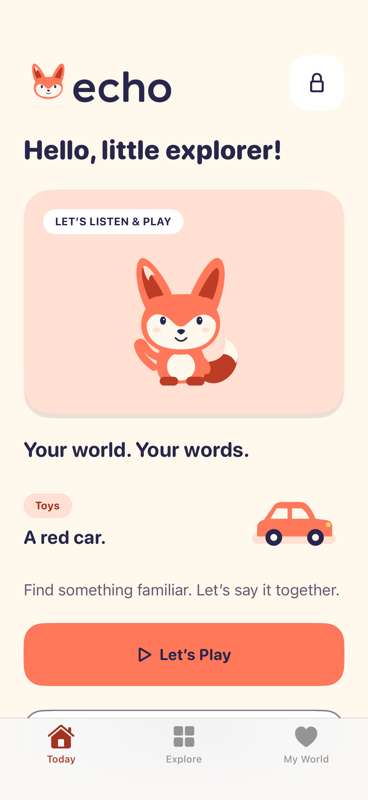

# Echo

把每天的小事，变成一起说出的英语。Echo 是面向 2–5 岁亲子家庭的原生 iPhone App：记下生活片段，家长确认一个词或短句，听示范、一起说，再回到真实生活中使用。

**v0.2.0 · build 2 · iOS 17+**。界面使用英文，生活片段、释义和家长提示支持中文。家庭数据保存在手机；无需账号、服务器或 Mac 常驻。

## 两种模式

| 模式 | 页面 | 使用方式 |
| --- | --- | --- |
| Children | Today / Explore / My World | 听家长已确认的表达，按生活场景探索，再遇见熟悉的内容；低龄孩子由家长陪同 |
| Parents | Overview / Moments / Settings | 通过系统设备认证后管理生活片段、审核表达和设置隐私；返回儿童区会重新锁定家长入口 |

App 非活跃时遮罩私人内容，切到后台后锁回儿童区；真实认证、锁屏和中断行为仍需设备验收。

角色、字标、场景插画和语义色来自 Echo 原创视觉系统。八个关键原生页面已接入，使用奶油底、珊瑚橙和靛蓝，支持深浅外观与 Dynamic Type。详情见 [设计说明](Design/README.md)。



页面预览：[Explore](docs/screenshots/explore-light.png) · [Listen & Say](docs/screenshots/listen-light.png) · [My World](docs/screenshots/world-light.png) · [Overview](docs/screenshots/overview-light.png) · [Add a Moment](docs/screenshots/moment-light.png) · [Review](docs/screenshots/review-light.png) · [Settings](docs/screenshots/settings-light.png) · [深色](docs/screenshots/today-dark.png) · [大字](docs/screenshots/overview-large.png)。这些是原生页面渲染截图，不等于点击、音频、认证或模型服务验收。

## 从一个生活片段开始

1. 点儿童区右上角家长入口，完成系统设备认证，进入 **Moments → Add a Moment**。
2. 先写发生了什么，再选场景。**Save Moment** 只保存到本机，不发送给模型。
3. 打开 Moment，手动添加表达，例如 `A red car.` 和中文释义；也可主动请求可选的英语候选。
4. 在审核页检查英文、释义、语块、朗读文本和 **Parent note**。**Keep as Draft** 留在家长区；**Confirm Expression** 后才进入儿童区。
5. 在 **Today / Explore / My World** 中主动选择 **Listen / Slow / Parts**；Parts 使用家长填写的语块。

确认、收藏和使用记录都不表示孩子已经掌握。家长提示不进入儿童区。Settings 可添加 20 个示例表达，包含 `I can say my ABC.`，供试听使用，不构成课程或能力记录。

### 声音与录音

- **Listen** 使用手机已安装的美式英语系统声线。Settings 可选择、预听和刷新声线；更多声线可在 iPhone 的辅助功能语音设置中下载。展示文本和朗读文本可分开填写，例如展示 `ABC`、朗读 `A, B, C`；系统朗读不会唱旋律。
- **Say It Together** 打开跟说页，再主动点击 **Start Recording** 才录音，最多 30 秒。停止后先试听，选择 **Save Recording** 才长期保存；Settings → **Manage Recordings** 可播放或逐条确认删除。
- **Add a Moment** 中的语音采集是独立可选操作，最多 45 秒。中文和英文分别选择，不自动区分说话人。
- 场景转写仅在设备端识别可用且权限允许时执行，无云端转写回退。选择 **Use This Transcript** 后仍需检查文字；不可识别时可以回听并手动输入。
- 临时采集音频在完成、取消或下一次启动清理。没有后台监听；权限提示、锁屏或后台中断后不会自行恢复录音。
- **Session reminder** 可选 Off / 3 / 5 / 10 minutes，默认为 5 分钟。这是可调整的家庭偏好，不是医疗标准或使用目标，不请求通知权限。

### 可选英语候选

本地添加、朗读、录音和回放不需要 API Key。云端默认关闭，只在家长主动请求时使用。

1. Settings 选择 DeepSeek 或 MiMo，填写自己的专用 API Key，点击 **Save Key** 并启用 **Enable cloud generation**。
2. 连接非计费、非低数据模式的 Wi-Fi。**Test with a Sample** 只发送无私人内容的样例，也计入当日请求额度。
3. 打开 Moment 的英语候选入口，编辑发送预览，勾选已移除姓名和私人信息，再明确同意发送。编辑预览会重置两项确认。
4. 请求只发送预览中的场景文字，不附带音频、其他 Moments 或家庭库。最多三个候选先保存为 Draft；逐条审核后确认。

默认模型 ID 为 [`deepseek-flash`](https://api-docs.deepseek.com/quick_start/pricing/) 和 [`mimo-v2.6-pro`](https://mimo.mi.com/models/en-US/mimo-v2.6-pro)，可在 Settings 修改。MiMo 当前使用按量付费 API 端点；Token Plan 使用独立 Key 和 base URL，不能把 Token Plan Key 粘贴到当前配置中混用。[MiMo 接入说明](https://mimo.mi.com/models/en-US/mimo-v2.6-pro)

接口只访问供应商固定 HTTPS 端点，不接受自定义代理地址。请求 30 秒超时，每日合计最多 20 次；失败不重试、不自动切换供应商，Wi-Fi 恢复后不自动发送。低数据模式、热点或 VPN 路由可能触发保守阻止。关闭云端不影响本地功能。

Key 仅存本机 Keychain，使用 `WhenUnlockedThisDeviceOnly`。移除 Key 不等于在供应商处撤销凭证；请设置供应商侧费用上限。去标识化由家长检查负责，应用不声称能自动识别所有姓名或敏感信息。模型输出不是儿童发展评估。

## 数据与恢复

- Core Data 保存版本化结构化快照，录音是独立 `.m4a` 文件。家庭目录、录音和导出文件使用 iOS 完整文件保护；家庭目录排除自动备份，不启用 CloudKit。
- **Prepare Export** 创建 `.echo101` 恢复包，默认导出文字和使用记录；录音需主动勾选。密钥和临时采集音频不进入导出。
- 恢复包是**未加密 JSON**，所选音频以 Base64 包含其中。分享后不再受 App 文件保护，请选择可信位置并自行管理副本。
- 恢复只允许空库，先检查版本、引用关系、路径、大小和音频 SHA-256，再提交；不会覆盖已有家庭内容。
- 恢复包上限 64 MiB，单录音 10 MiB，全部录音合计 32 MiB。可先导出不含录音的版本。
- 家长提示会随表达保存、导出和恢复；旧数据没有该可选字段时仍可读取。
- 删除 Moment 会删除关联表达、录音和使用记录；删除单条录音保留表达。已导出的历史副本不会自动更新。
- 卸载会删除本地库。覆盖安装更新可保留数据；更新或换机前先导出。

## 构建与测试

```text
Echo101/                 SwiftUI、音频、设备权限、原生资产
Sources/EchoCore/        数据、Core Data、录音文件、导出恢复
Sources/EchoAPI/         供应商适配、Wi-Fi 门禁、Keychain、请求配额
Tests/                  Core 与 mock 网络测试
Echo101UITests/          独立测试库的设备 UI 测试
Echo101.xcodeproj/       原生工程与共享 Scheme
Design/                 视觉规范与设计变量
docs/ACCEPTANCE.md       验收状态与家庭检查清单
```

项目使用 Swift 6，无第三方运行时依赖。当前 Core Data 使用一个 `EchoState` 实体保存结构化快照，更新先验证、事务保存后再发布。未确认表达不能写入播放记录或录音。

在项目根目录运行核心和模型测试：

```sh
DEVELOPER_DIR=/Applications/Xcode.app/Contents/Developer \
swift test --disable-sandbox --scratch-path /tmp/echo101-tests
```

模型测试使用假响应，不访问真实供应商或家庭内容。UI 测试使用独立目录、UserDefaults 和 Keychain service，不修改家庭库。

使用 Xcode 打开 `Echo101.xcodeproj`，选择 Echo101 Scheme，配置自己的开发团队和 iPhone。覆盖更新时保持 Bundle ID `com.henrypann.echo101` 不变，无需删除 App。编译示例：

```sh
DEVELOPER_DIR=/Applications/Xcode.app/Contents/Developer \
xcodebuild -project Echo101.xcodeproj -scheme Echo101 \
  -destination 'generic/platform=iOS' \
  -derivedDataPath /tmp/echo101-device-build build-for-testing
```

UI 测试需连接设备并具备测试运行器签名名额；免费签名的设备名额不足时，主 App 安装成功不意味着 UI 测试可运行。签名到期后重新签名覆盖安装。

当前 **Core 23 + API 26，共 49 项通过，0 失败**；签名设备 `build-for-testing` 和无签名 Release 编译通过，主 App 已覆盖安装。4 项 iPhone XS UI 交互测试未执行。[GitHub Actions](.github/workflows/ios.yml) 已配置在 CI 预装的 iPhone 模拟器运行这些流程，结果待运行；CI 结果不能替代 XS 实测。系统认证、离线 20 句听感、录音中断、真实模型请求和家庭恢复仍需实测，见 [验收清单](docs/ACCEPTANCE.md)。
